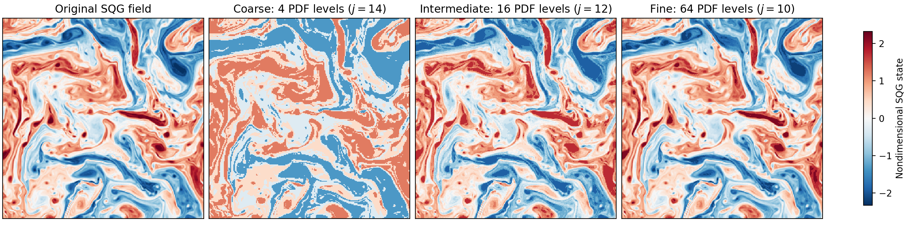

# Orthogonal PDF Decomposition

This repository contains NumPy and PyTorch implementations of the multilevel orthogonal transform in the probability-density-function domain (OPT), the reconstruction step underlying orthogonal PDF decomposition (OPD). The code grew from a 2024 project on multiscale structure in heterogeneous and turbulent fields.

The construction can be viewed as a PDF-domain counterpart of the two-dimensional Haar transform. Whereas the Haar transform forms multilevel averages from spatially adjacent grid points, OPT first sorts the field values and forms the hierarchy in value space. At level `j`, consecutive groups of `2**j` sorted values are replaced by their group means and then mapped back to their original locations. Increasing the level produces progressively coarser approximations while retaining the spatial footprint of structures with similar amplitudes.

The implementation accepts one-, two-, and three-dimensional arrays through the same interface. The PyTorch backend can run on CPU, CUDA, or Apple MPS devices.



## Repository contents

- `opd/numpy_opd.py`: NumPy transform, multilevel decomposition, and reconstruction.
- `opd/torch_opd.py`: equivalent PyTorch implementation.
- `examples/signal_1d.py`: multilevel reconstruction of a one-dimensional signal.
- `examples/field_2d.py`: decomposition of a two-layer SQG turbulence snapshot.
- `examples/volume_3d.py`: decomposition of a three-dimensional volume, shown through a central slice.
- `examples/torch_backend.py`: comparison of the NumPy and PyTorch backends.
- `tests/test_opd.py`: shape, reconstruction, orthogonality, and backend-consistency checks.

## Usage

```bash
python -m pip install -r requirements.txt
python -m examples.signal_1d
python -m examples.field_2d
python -m examples.volume_3d
```

The figures are written to `figures/`.

```python
import numpy as np
from opd import decompose, reconstruct, transform

field = np.random.default_rng(0).normal(size=(64, 64))
approximation = transform(field, level=7)

coarse, details = decompose(field)
recovered = reconstruct(coarse, details)
```

Install PyTorch separately to use the accelerated backend:

```bash
python -m pip install torch
python -m examples.torch_backend
```

Run the tests with:

```bash
python -m unittest discover -s tests
```

## Scope

The repository focuses on the multilevel OPT and its orthogonal detail fields. The complete OPD procedure described in the original study also identifies connected patches in reconstructed fields, assigns characteristic length scales, and constructs a scale-based energy spectrum. Those patch and spectrum calculations are not included here.

## References

Liu, S., Shao, Y., Hintz, M., and Lennartz-Sassinek, S. (2015). Multiscale decomposition for heterogeneous land-atmosphere systems. *Journal of Geophysical Research: Atmospheres*, 120, 917–930. https://doi.org/10.1002/2014JD022258

Tulloch, R., and Smith, K. S. (2009). A note on the numerical representation of surface dynamics in quasigeostrophic turbulence: Application to the nonlinear Eady model. *Journal of the Atmospheric Sciences*, 66(4), 1063–1068. https://doi.org/10.1175/2008JAS2921.1

The SQG snapshot used in the two-dimensional example was generated with Jeffrey S. Whitaker's [`sqgturb`](https://github.com/jswhit/sqgturb) implementation.
